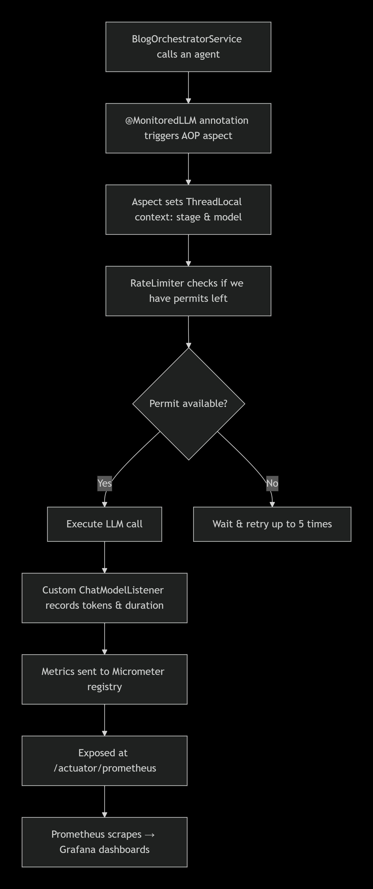

# 📊 LLM Monitoring & Rate Limiting – AI Blog Studio

> **Purpose**: Explain what we built, why we built it, and how it works – in simple language.

---

## 🎯 What Did We Build?

We added **observability** (monitoring) and **rate limiting** to the AI Blog Studio application. Now we can see:

- How many **tokens** each AI model uses (per pipeline stage)
- How many **requests** per minute (RPM) we send to each AI provider
- How long each pipeline **stage** takes
- If any **errors** happen during LLM calls

We also **prevent** our app from being blocked by AI providers because of too many requests.

---

## ❓ Why Did We Need This?

| Reason | Explanation |
| :--- | :--- |
| **Cost Tracking** | Every token costs money. We need to know how much we spend per blog and per model. |
| **Avoid 429 Errors** | AI providers limit how many requests we can send per minute. If we exceed the limit, they return `429 Too Many Requests` and our blog generation fails. We now **slow down automatically** before that happens. |
| **Debugging & Performance** | If the blog generation is slow or fails, we can see exactly which stage caused the problem. |
| **Future Proofing** | When we start using different models for different agents, we can compare their cost and speed. |

---

## 🧰 How Does It Work? (The Big Picture)

Every time our app calls an AI model (like Step‑3.5‑Flash or Llama), the following happens **automatically**:



## 📦 Which Technologies Are Used?

| Technology | What It Does |
| :--- | :--- |
| #### **LangChain4j** | Our Java framework to talk to LLMs. |
| #### **Micrometer** | Collects metrics (counters, timers) and sends them to monitoring systems. |
| #### **Resilience4j** | Implements the **Rate Limiter** – the "traffic cop" for requests. |
| #### **Spring AOP** | Intercepts `@MonitoredLLM` calls to remove boilerplate code. |
| #### **Actuator** | Exposes `/actuator/prometheus` for data scraping. |
| #### **Prometheus** | Visualizes metrics over time (optional). |

---

## ⚙️ How We Implemented It – Step by Step

### 1. Custom `ChatModelListener`

| Attribute | Details |
| :--- | :--- |
| **Where** | `LangChainConfig.java` |
| **What it does** | Every time **LangChain4j** sends a request and gets a response, this listener is triggered automatically. |

#### **Key Data Recorded:**
* **Input tokens** used per request.
* **Output tokens** used per request.
* **Contextual Metadata:** Tracks which **stage** (e.g., planner, writer) and which **model** were used via `ThreadLocal`.

#### **Metrics Created:**
* `llm.tokens.input`
* `llm.tokens.output`
* `llm.requests`
* `llm.errors`

---

### 2. Rate Limiter Beans (Resilience4j)

| Attribute | Details |
| :--- | :--- |
| **Where** | `LangChainConfig.java` |
| **What it does** | Creates one rate limiter per AI provider (e.g., `stepfunRateLimiter` for StepFlash, `cerebrasRateLimiter` for Cerebras). |

#### **Details:**
* **Configuration:** RPM limit comes from `application.yml` (e.g., `stepfun.rpm.limit: 50`).
* **Behavior:** If the limit is reached, the limiter blocks the thread until a permit is available (or times out).

---

### 3. Annotation `@MonitoredLLM`

| Attribute | Details |
| :--- | :--- |
| **Where** | `annotation/MonitoredLLM.java` |
| **What it is** | A custom annotation with three attributes: **stage** (e.g., "planner"), **modelKey** (e.g., "step-flash"), and **providerKey** (e.g., "stepfun"). |
| **Why** | Instead of writing the same boilerplate code for every agent call, we just annotate a method. |

---

### 4. AOP Aspect `LLMMonitoringAspect`

| Attribute | Details |
| :--- | :--- |
| **Where** | `aspect/LLMMonitoringAspect.java` |
| **What it does** | Intercepts any method annotated with `@MonitoredLLM`. |

---

#### **Operations:**
* Sets `ThreadLocal` context (stage, model) so the listener knows which stage is calling.
* Retrieves the correct `RateLimiter` from a registry map using `providerKey`.
* Wraps the method call with the rate limiter and retries on `RequestNotPermitted`.
* Records stage duration and success/failure counters.
* Cleans up `ThreadLocal` after the call.

---

### 5. Service Simplification

| Attribute | Details |
| :--- | :--- |
| **Where** | `BlogOrchestratorService.java` |

* **Before:** We had a long `callWithRateLimitRetry` method and manual timer tracking.
* **After:** Each agent call is a tiny private method with the annotation:

```java
@MonitoredLLM(stage = "planner", modelKey = "cerebras-qwen", providerKey = "cerebras")
private String callPlanner(String topic) {
    return plannerAgent.plan(topic);
}
```

* **Result:** The service code is clean and easy to read.

---

### 6. Configuration Properties

| Attribute | Details |
| :--- | :--- |
| **Where** | `application.yml` |
| **What** | We define RPM limits per provider so we can change them without recompiling code. |

---

### 🔍 When Does This All Happen?

| Event | Trigger |
| :--- | :--- |
| **Token counting** | During every LLM response – the listener `onResponse()` is called automatically. |
| **Rate limiting** | Before every LLM request – the aspect intercepts the method call. |
| **Metrics export** | Continuously – Micrometer aggregates counters and timers in memory; Prometheus scrapes every few seconds. |

---

### 📈 What Metrics Can We See?

After running the app, visit `http://localhost:8080/actuator/prometheus`. You'll see lines like:

```text
# HELP llm_tokens_input_total
# TYPE llm_tokens_input_total counter
llm_tokens_input_total{stage="planner",model="cerebras-qwen"} 1245.0  
llm_tokens_input_total{stage="write",model="step-flash"} 892.0

# HELP blog_stage_duration_seconds
blog_stage_duration_seconds_bucket{stage="planner",le="0.1"} 2.0

# HELP resilience4j_ratelimiter_available_permissions
resilience4j_ratelimiter_available_permissions{name="stepfun"} 48.0
```

### Metrics Glossary

| Metric | Meaning |
| :--- | :--- |
| **llm_tokens_input_total** | Total input tokens used per stage/model |
| **llm_tokens_output_total** | Total output tokens used per stage/model |
| **llm_requests_total** | Number of LLM calls per stage/model |
| **blog_stage_duration_seconds** | How long each pipeline stage took |
| **blog_ratelimit_retries_total** | How many times we had to wait because of rate limits |

---

### 🧠 Why Use ThreadLocal for Stage Context?

* **Problem:** The `ChatModelListener` is a global listener – it doesn't know which pipeline stage just made the call.
* **Solution:** Before calling the agent, we store the stage name in a `ThreadLocal` variable. The listener reads it from the same thread.
* **Important:** We **must** clear the `ThreadLocal` after the call to avoid memory leaks. The aspect does this automatically in a `finally` block.

---

### 🔁 Retry Logic for Rate Limits

* **Behavior:** When the rate limiter denies a request (`RequestNotPermitted`), we wait and retry up to **5 times**.
* **Wait Time:** The wait time is extracted from the error message (if the provider tells us how long to wait) or defaults to **20 seconds**.
* **Metrics:** Each retry is counted as a metric (`blog.ratelimit.retries`).

---

### 🚀 How to Extend for More Models in the Future

1. **Add a new `@Bean`** for the new `ChatModel` in `LangChainConfig`.
2. **Add the model** to the `modelRegistry` map.
3. **Create a new `RateLimiter` bean** for the new provider.
4. **Update the `STAGE_MODEL_MAP`** or simply change the annotation parameters in the service.
5. **That's it** – the aspect and listener work automatically.

---

### 📁 File Overview (What Goes Where)

| File | Package | Purpose |
| :--- | :--- | :--- |
| **LangChainConfig.java** | `com.aiblogstudio.config` | Defines all models, listeners, rate limiters, and registries. |
| **BlogOrchestratorService.java** | `com.aiblogstudio.service` | Orchestrates the pipeline; uses `@MonitoredLLM` methods. |
| **MonitoredLLM.java** | `com.aiblogstudio.annotation` | Custom annotation definition. |
| **LLMMonitoringAspect.java** | `com.aiblogstudio.aspect` | AOP aspect that applies rate limiting and metrics. |
| **application.yml** | `src/main/resources` | RPM limits and other configuration. |

---

### ✅ Summary – In One Sentence

We made our app smarter by automatically tracking token usage and respecting API rate limits, without cluttering our business logic, using **Spring AOP**, **Micrometer**, and **Resilience4j**.

